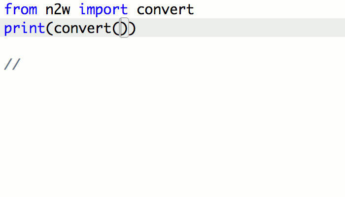

# python-n2w
[](https://www.codacy.com/app/abtcolns/python-n2w?utm_source=github.com&utm_medium=referral&utm_content=collin5/python-n2w&utm_campaign=badger)
[](https://travis-ci.org/collin5/python-n2w)
[](https://coveralls.io/github/collin5/python-n2w)
[](https://badge.fury.io/py/n2w)


A Python library that transforms numbers to words.




## Installation
To add to your project, just do `pip install n2w`
## Usage
```
from n2w import convert
result = convert(123456)
```
## License
[](https://opensource.org/licenses/MIT)
MIT © [Collins](https://github.com/collin5/)

